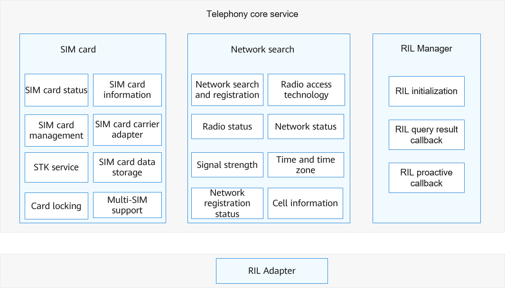

# Telephony Core Service<a name="EN-US_TOPIC_0000001152064913"></a>

-   [Introduction](#section117mcpsimp)
-   [Directory Structure](#section129mcpsimp)
-   [Constraints](#section133mcpsimp)
-   [Available APIs](#section139mcpsimp)
    -   [APIs for the SIM Card Service](#section142mcpsimp)
    -   [APIs for the Radio Service](#section198mcpsimp)

-   [Usage Guidelines](#section370mcpsimp)
    -   [Radio Service](#section393mcpsimp)
    -   [SIM Card Service](#section402mcpsimp)

-   [Repositories Involved](#section409mcpsimp)

## Introduction<a name="section117mcpsimp"></a>

The telephony core service initializes the RIL Manager, SIM card, and radio modules, and provides access to the RIL Adapter service.

You can implement communication with the RIL Adapter by registering the callback service and implement communication between modules by subscribing to callbacks.

**Figure  1**  Architecture of the telephony core service<a name="fig5700192716219"></a>




As shown in the preceding figure, the telephony core service consists of the following:

-   SIM card service: Provides services including SIM card initialization, file read/write, loading status notification, and single-SIM/dual-SIM control. These services implement functions such as SIM card status query, SIM card management, SIM card control, STK, contact storage, and SMS storage.
-   Radio service: Provides services including network registration and network status acquisition. These services offer functions such as network registration, network mode query, radio service status query, radio service management, signal strength query, cell management, registration status management, and time and time zone setting.
-   RIL Manager service: Provides the proactive callback service and query result callback service.

## Directory Structure<a name="section129mcpsimp"></a>

```
/base/telphony/core_service
├── interfaces             # APIs
│   ├── innerkits          # Internal APIs
│   └── kits               # External APIs \(such as JS APIs\)
├── services               # Implementation of the telephony core service
│   ├── include
│   └── src
├── etc                    # Telephony core service driver scripts
│   └── init
├── sa_profile             # SA profile
├── tel_ril                # Telephony core service and RIL Adapter communication
│   ├── include
│   ├── src
├── network_search         # Radio service
│   ├── include
│   ├── src
├── sim                    # SIM card service
│   ├── include
│   ├── src
├── common
│   ├── log                # Telephony core service log
│   ├── preferences
│   ├── utils
└── test                   # Unit test
    └── unittest
```

## Constraints<a name="section133mcpsimp"></a>

-   Programming language: C++ and JavaScript.
-   Software constraints: This module must work with the RIL Adapter service \(ril\_adapter\) and status registration service \(state\_registry\).
-   Hardware constraints: The accommodating device must be equipped with a modem and a SIM card capable of independent cellular communication.

## Available APIs<a name="section139mcpsimp"></a>

The telephony core service module needs to provide APIs for related modules, including the SIM card and radio modules.

###  APIs for the SIM Card Service<a name="section142mcpsimp"></a>

| API| Description| Required Permission|
| ------------------------------------------------------------ | ----------------------------------------------------------- | ----------------------------------- |
| function getSimState(slotId: number, callback: AsyncCallback\<SimState>): void; | Obtains the state of the SIM card in a specified slot.| None|
| function getSimGid1(slotId: number, callback: AsyncCallback\<string>): void; | Obtains the group identifier level 1 \(GID1\) of the SIM card in the specified slot.| ohos.permission.GET_TELEPHONY_STATE |
| function getSimIccId(slotId: number, callback: AsyncCallback\<string>): void; | Obtains the integrated circuit card identity \(ICCID\) of the SIM card in the specified slot.| ohos.permission.GET_TELEPHONY_STATE |
| function getISOCountryCodeForSim(slotId: number, callback: AsyncCallback\<string>): void; | Obtains the ISO country code of the SIM card in the specified slot.| None|
| function getSimOperatorNumeric(slotId: number, callback: AsyncCallback\<string>): void; | Obtains the public land mobile network \(PLMN\) ID of the SIM card in the specified slot. | None|
| function getSimSpn(slotId: number, callback: AsyncCallback\<string>): void; | Obtains the service provider name \(SPN\) of the SIM card in the specified slot.| None|
| function getDefaultVoiceSlotId(callback: AsyncCallback\<number>): void; | Obtains the slot of the default SIM card that provides the voice service.| None|


For details about the complete description of JavaScript APIs and sample code, see [SIM Card Management](https://gitee.com/openharmony/docs/blob/master/en/application-dev/js-reference/apis/js-apis-sim.md).

### APIs for the Radio Service<a name="section198mcpsimp"></a>

| API| Description| Required Permission|
| ------------------------------------------------------------ | -------------------------- | ----------------------------------- |
| function getRadioTech(slotId: number, callback: AsyncCallback\<{psRadioTech: RadioTechnology, csRadioTech: RadioTechnology}>): void; | Obtains the current radio access technology of the SIM card in the specified slot.| ohos.permission.GET_NETWORK_INFO    |
| function getSignalInformation(slotId: number, callback: AsyncCallback\<Array\<SignalInformation>>): void; | Obtains the signal information of the SIM card in the specified slot.| None|
| function getNetworkState(slotId: number, callback: AsyncCallback\<NetworkState>): void; | Obtains the network status of the SIM card in the specified slot.| ohos.permission.GET_NETWORK_INFO    |
| function getISOCountryCodeForNetwork(slotId: number, callback: AsyncCallback\<string>): void; | Obtains the ISO country code of the SIM card in the specified slot.| None|
| function getNetworkSearchInformation(slotId: number, callback: AsyncCallback\<NetworkSearchResult>): void; | Obtains the manual network search result of the SIM card in the specified slot.| ohos.permission.GET_TELEPHONY_STATE |
| function getNetworkSelectionMode(slotId: number, callback: AsyncCallback\<NetworkSelectionMode>): void; | Obtains the network selection mode of the SIM card in the specified slot.| None|
| function setNetworkSelectionMode(options: NetworkSelectionModeOptions, callback: AsyncCallback\<void>): void; | Sets the network selection mode of the SIM card in the specified slot.| ohos.permission.SET_TELEPHONY_STATE |
| function isRadioOn(callback: AsyncCallback\<boolean>): void;  | Checks whether the radio service is enabled.| ohos.permission.GET_NETWORK_INFO    |
| function turnOnRadio(callback: AsyncCallback\<void>): void;   | Enables the radio service.| ohos.permission.SET_TELEPHONY_STATE |
| function turnOffRadio(callback: AsyncCallback\<void>): void;  | Disables the radio service.| ohos.permission.SET_TELEPHONY_STATE |


For details about the complete description of JavaScript APIs and sample code, see [Radio](https://gitee.com/openharmony/docs/blob/master/en/application-dev/js-reference/apis/js-apis-radio.md).

**Note:**

>The RIL Manager does not provide external APIs. It can only be called by modules of the Telephony subsystem.

## Usage Guidelines<a name="section370mcpsimp"></a>

### Radio Service<a name="section393mcpsimp"></a> 

The function of obtaining the network status is used as an example. The process is as follows:

1.  Query the SIM card in the slot specified by **slotId**. If **slotId** is not set, information about the primary card is queried by default.
2.  Call the **getNetworkState** method in callback or promise mode to query the network status.
3.  Obtain the query result. The **getNetworkState** API works in asynchronous mode. The query result is returned through the callback.

    ```
    import radio from "@ohos.telephony.radio";
    
    // Set the value of slotId.
    let slotId = 0;
    
    // Call the API in callback mode.
    radio.getNetworkState(slotId, (err, value) => {
      if (err) {
        // If the API call fails, err is not empty.
        console.error(`failed to getNetworkState because ${err.message}`);
        return;
      }
      // If the API call is successful, err is empty.
      console.log(`success to getNetworkState: ${value}`);
    });
    
    // Call the API in promise mode.
    let promise = radio.getNetworkState(slotId);
    promise.then((value) => {
      // The API call is successful.
      console.log(`success to getNetworkState: ${value}`);
    }).catch((err) => {
      // The API call fails.
      console.error(`failed to getNetworkState because ${err.message}`);
    });
    ```


### SIM Card Service<a name="section402mcpsimp"></a>

The function of querying the status of a specified SIM card is used as an example. The process is as follows:

1.  Set the value of **slotId**.
2.  Call the **getSimState** method in callback or promise mode to query the SIM card status.
3.  Obtain the query result. The **getSimState** API works in asynchronous mode. The query result is returned through the callback.

    ```
    import sim from "@ohos.telephony.sim";
    
    // Set the value of slotId.
    let slotId = 0;
    
    // Call the API in callback mode.
    sim.getSimState(slotId, (err, value) => {
      if (err) {
        // If the API call fails, err is not empty.
        console.error(`failed to getSimState because ${err.message}`);
        return;
      }
      // If the API call is successful, err is empty.
      console.log(`success to getSimState: ${value}`);
    });
    
    // Call the API in promise mode.
    let promise = sim.getSimState(slotId);
    promise.then((value) => {
      // The API call is successful.
      console.log(`success to getSimState: ${value}`);
    }).catch((err) => {
      // The API call fails.
      console.error(`failed to getSimState because ${err.message}`);
    });
    ```


## Repositories Involved<a name="section409mcpsimp"></a>

[Telephony Subsystem](https://gitee.com/openharmony/docs/blob/master/en/readme/telephony.md)

**telephony\_core\_service**

[telephony\_sms\_mms](https://gitee.com/openharmony/telephony_sms_mms/blob/master/README.md)

[telephony\_ril\_adapter](https://gitee.com/openharmony/telephony_ril_adapter/blob/master/README.md)
