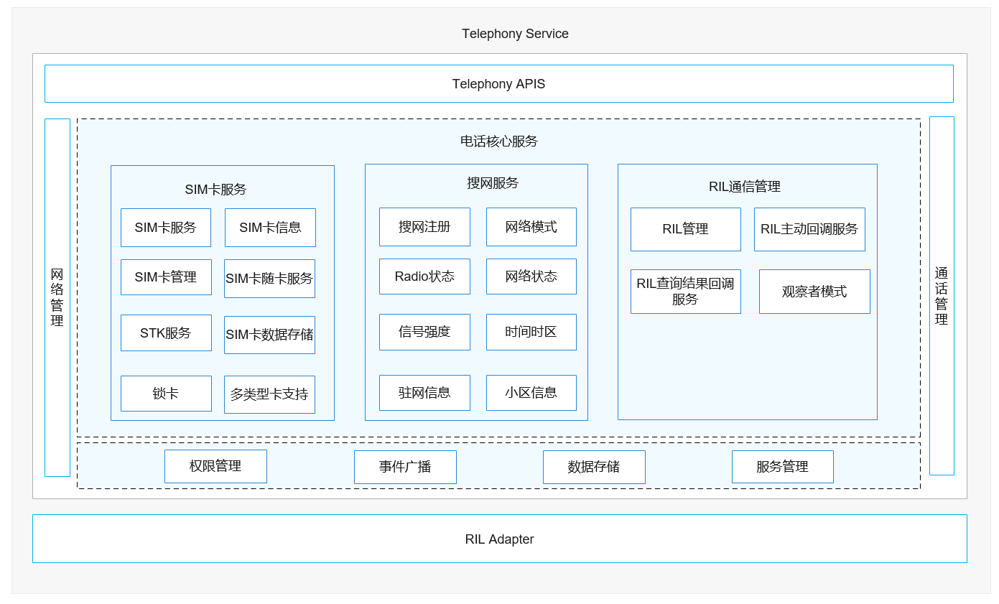

# 核心服务<a name="ZH-CN_TOPIC_0000001152064913"></a>

-   [简介](#section117mcpsimp)
-   [目录](#section129mcpsimp)
-   [约束](#section133mcpsimp)
-   [接口说明](#section139mcpsimp)
    -   [SIM卡对外提供的接口](#section142mcpsimp)
    -   [搜网服务对外提供的接口](#section198mcpsimp)

-   [使用说明](#section370mcpsimp)
    -   [搜网](#section393mcpsimp)
    -   [SIM卡](#section402mcpsimp)

-   [相关仓](#section409mcpsimp)

## 简介<a name="section117mcpsimp"></a>

核心服务模块主要功能是初始化SIM卡服务、搜网服务和RIL管理，以及获取RIL Adapter服务。

通过注册回调服务，实现与RIL Adapter进行通信；通过发布订阅，来实现与各功能模块的通信。

**图 1**  核心服务架构图<a name="fig5700192716219"></a>


 

上图示中核心服务关联的业务服务包括SIM卡服务、搜网服务、RIL通信管理。

-   SIM卡服务：主要是SIM卡初始化，文件读写，加载状态通知，单双卡控制，包括SIM卡状态查询、SIM卡管理、SIM卡控制、STK、联系人存储、短信存储。
-   搜网服务：主要是网络注册，网络状态获取，包括网络注册、网络模式查询、IMS网络状态上报、Radio状态查询、搜网管理、信号强度查询、小区管理、驻网管理、时间时区更新。
-   RIL管理：提供主动回调服务，查询结果回调服务等。

## 目录<a name="section129mcpsimp"></a>

```sh
/base/telephony/core_service
├── figures                       # Readme资源文件
├── frameworks                    # 框架层目录
│   ├── js                        # js相关代码
│   └── native                    # native相关代码
├── interfaces                    # 接口目录
│   ├── innerkits                 # 部件间的内部接口
│   └── kits                      # 对应用提供的接口（例如JS接口）
├── sa_profile                    # 核心服务的启动文件目录
├── services                      # 核心服务实现代码目录
│   ├── core                      # 核心服务的核心文件目录
│   ├── etc                       # 核心服务的驱动脚本目录
|   ├── ims_service_interaction   # IMS网络状态上报实现代码目录
│   ├── network_search            # 搜网服务代码目录
│   ├── sim                       # SIM卡服务代码目录
│   └── tel_ril                   # 核心服务与RIL Adapter通信代码目录
├── test                          # 核心服务测试代码目录
│   ├── fuzztest                  # 模糊测试相关代码
│   └── unittest                  # 单元测试相关代码
└── utils                         # 核心服务工具代码目录
    ├── common                    # 核心服务通用工具目录
    ├── log                       # 核心服务日志工具目录
    └── preferences               # 核心服务属性偏好工具目录
```

## 约束<a name="section133mcpsimp"></a>

-   开发语言：C++ 、Java Script。
-   软件约束：需要与以下服务配合使用：HDF(drivers\_interface，drivers\_peripheral)，RIL适配（ril\_adapter），状态注册服务（state\_registry）。
-   硬件约束：需要搭载的设备支持以下硬件：可以进行独立蜂窝通信的Modem以及SIM卡。

## 接口说明<a name="section139mcpsimp"></a>

核心服务模块需要提供SIM卡，搜网相关模块的接口。

###  SIM卡对外提供的接口<a name="section142mcpsimp"></a>

| 接口名称                                                     | 接口描述                                                    | 所需权限                            |
| ------------------------------------------------------------ | ----------------------------------------------------------- | ----------------------------------- |
| function getSimState(slotId: number, callback: AsyncCallback\<SimState>): void; | 获取指定卡槽的SIM卡状态                                     | 无                                  |
| function getSimGid1(slotId: number, callback: AsyncCallback\<string>): void; | 获取指定卡槽SIM卡的GID1(Group Identifier Level 1)           | ohos.permission.GET_TELEPHONY_STATE |
| function getSimIccId(slotId: number, callback: AsyncCallback\<string>): void; | 获取指定卡槽SIM卡的ICCID（Integrate Circuit Card Identity） | ohos.permission.GET_TELEPHONY_STATE |
| function getISOCountryCodeForSim(slotId: number, callback: AsyncCallback\<string>): void; | 获取指定卡槽SIM卡的ISO国家码                                | 无                                  |
| function getSimOperatorNumeric(slotId: number, callback: AsyncCallback\<string>): void; | 获取指定卡槽SIM卡的归属PLMN（Public Land Mobile Network）号 | 无                                  |
| function getSimSpn(slotId: number, callback: AsyncCallback\<string>): void; | 获取指定卡槽SIM卡的运营商SPN（Service Provider Name）       | 无                                  |
| function getDefaultVoiceSlotId(callback: AsyncCallback\<number>): void; | 获取语音业务的默认卡卡槽                                    | 无                                  |
| function getDefaultVoiceSimId(callback: AsyncCallback\<number>): void; | 获取语音业务的默认卡ID                                    | 无                                  |
| function isSimActive(slotId: number, callback: AsyncCallback\<boolean>): void | 检查指定卡槽的SIM卡是否激活                           | 无 |
| function hasSimCard(slotId: number, callback: AsyncCallback\<boolean>): void  | 检查SIM卡是否插入指定卡槽                             | 无                                  |
| function getSimTelephoneNumber(slotId: number, callback: AsyncCallback\<string>): void | 获取指定卡槽SIM卡的MSISDN（Mobile Station Integrated Services Digital Network）|ohos.permission.GET_PHONE_NUMBERS |
| function getVoiceMailIdentifier(slotId: number, callback: AsyncCallback\<string>): void | 获取指定卡槽SIM卡语音信箱的身份标识 | ohos.permission.GET_TELEPHONY_STATE |
| function getVoiceMailNumber(slotId: number, callback: AsyncCallback\<string>): void | 获取指定卡槽SIM卡的语音邮箱号码 | ohos.permission.GET_TELEPHONY_STATE |
| function getCardType(slotId: number, callback: AsyncCallback\<CardType>): void | 获取指定卡槽SIM卡的类型 | 无 |
| function hasOperatorPrivileges(slotId: number, callback: AsyncCallback\<boolean>): void | 检查应用（调用者）是否已被授予运营商权限 | 无 |
| function getMaxSimCount(): number | 获取设备上可同时使用的最大SIM卡数，即最大SIM卡槽数。 | 无 |

完整的JS API说明以及实例代码请参考：[SIM卡管理](https://gitee.com/openharmony/docs/blob/master/zh-cn/application-dev/reference/apis/js-apis-sim.md)。

### 搜网服务对外提供的接口<a name="section198mcpsimp"></a>

| 接口名称                                                     | 接口描述                      | 所需权限                            |
| ------------------------------------------------------------ | ----------------------------- | ----------------------------------- |
| function getRadioTech(slotId: number, callback: AsyncCallback\<{psRadioTech: RadioTechnology, csRadioTech: RadioTechnology}>): void; | 获取指定卡槽的当前接入技术    | ohos.permission.GET_NETWORK_INFO    |
| function getSignalInformation(slotId: number, callback: AsyncCallback\<Array\<SignalInformation>>): void; | 获取指定卡槽的信号列表        | 无                                  |
| function getNetworkState(slotId: number, callback: AsyncCallback\<NetworkState>): void; | 获取指定卡槽的网络状态        | ohos.permission.GET_NETWORK_INFO    |
| function getISOCountryCodeForNetwork(slotId: number, callback: AsyncCallback\<string>): void; | 获取指定卡槽的网络国家码      | 无                                  |
| function getNetworkSearchInformation(slotId: number, callback: AsyncCallback\<NetworkSearchResult>): void; | 获取指定卡槽的手动搜网结果    | ohos.permission.GET_TELEPHONY_STATE |
| function getNetworkSelectionMode(slotId: number, callback: AsyncCallback\<NetworkSelectionMode>): void; | 获取指定卡槽的选网模式        | 无                                  |
| function setNetworkSelectionMode(options: NetworkSelectionModeOptions, callback: AsyncCallback\<void>): void; | 设置指定卡槽的选网模式        | ohos.permission.SET_TELEPHONY_STATE |
| function isRadioOn(callback: AsyncCallback\<boolean>): void; | 判断主卡Radio是否打开         | ohos.permission.GET_NETWORK_INFO    |
| function isRadioOn(slotId: number, callback: AsyncCallback\<boolean>): void; | 判断指定卡槽位的Radio是否打开 | ohos.permission.GET_NETWORK_INFO    |
| function turnOnRadio(callback: AsyncCallback\<void>): void;  | 开启主卡Radio                 | ohos.permission.SET_TELEPHONY_STATE |
| function turnOnRadio(slotId: number, callback: AsyncCallback\<void>): void; | 开启指定卡槽位的Radio         | ohos.permission.SET_TELEPHONY_STATE |
| function turnOffRadio(callback: AsyncCallback\<void>): void; | 关闭主卡Radio                 | ohos.permission.SET_TELEPHONY_STATE |
| function turnOffRadio(slotId: number, callback: AsyncCallback\<void>): void; | 关闭指定卡槽位的Radio         | ohos.permission.SET_TELEPHONY_STATE |
| function getOperatorName(slotId: number, callback: AsyncCallback\<string>): void; | 获取指定卡槽的运营商名称      | 无                                  |
| function setPreferredNetwork(slotId: number, networkMode: PreferredNetworkMode, callback: AsyncCallback\<void>): void; | 设置指定卡槽的优选网络模式    | ohos.permission.SET_TELEPHONY_STATE |
| function getPreferredNetwork(slotId: number, callback: AsyncCallback\<PreferredNetworkMode>): void; | 获取指定卡槽的优选网络模式    | ohos.permission.GET_TELEPHONY_STATE |
| function getCellInformation(slotId: number, callback: AsyncCallback<Array\<CellInformation>>) | 获取小区信息列表              | ohos.permission.LOCATION 和 ohos.permission.APPROXIMATELY_LOCATION          |
| function sendUpdateCellLocationRequest(slotId: number, callback: AsyncCallback\<void>) | 请求小区位置                  | ohos.permission.LOCATION 和 ohos.permission.APPROXIMATELY_LOCATION            |
| function getIMEI(slotId: number, callback: AsyncCallback\<string>) | 获取Imei                      | ohos.permission.GET_TELEPHONY_STATE |
| function getMEID(slotId: number, callback: AsyncCallback\<string>） | 获取Meid                      | ohos.permission.GET_TELEPHONY_STATE |
| function getUniqueDeviceId(slotId: number, callback: AsyncCallback\<string>） | 获取设备唯一标识码            | ohos.permission.GET_TELEPHONY_STATE |
| function getNrOptionMode(slotId: number, callback: AsyncCallback\<NrOptionMode>） | 获取5G模式                    | 无 |
| function isNrSupported: boolean;                             | 是否支持5g网络                | 无                                  |
| function getImsRegInfo(slotId: number, imsType: ImsServiceType, callback: AsyncCallback\<ImsRegInfo>): void; | 获取IMS注册测状态信息  | ohos.permission.GET_TELEPHONY_STATE  |
| function on(type: 'imsRegStateChange', slotId: number, imsType: ImsServiceType, callback: Callback\<ImsRegInfo>): void; | 注册IMS网络状态变化回调  | ohos.permission.GET_TELEPHONY_STATE  |
| function off(type: 'imsRegStateChange', slotId: number, imsType: ImsServiceType, callback?: Callback\<ImsRegInfo>): void; | 反注册IMS网络状态变化回调   | ohos.permission.GET_TELEPHONY_STATE  |


完整的JS API说明以及实例代码请参考：[网络搜索](https://gitee.com/openharmony/docs/blob/master/zh-cn/application-dev/reference/apis/js-apis-radio.md)。

**说明：**

>RIL管理不对外暴露接口，由电话服务子系统其他各个模块调用。

## 使用说明<a name="section370mcpsimp"></a>

### 搜网<a name="section393mcpsimp"></a>

获取网络状态接口调用流程及示例代码：

1.  指定查询的slotId，若不指定默认查询主卡信息。
2.  可以通过callback或者Promise的方式调用getNetworkState方法，返回网络状态信息。
3.  该接口为异步接口，相关执行结果会从callback中返回。

    ```js
    import radio from "@ohos.telephony.radio";

    // 参数赋值
    let slotId = 0;

    // 调用接口【callback方式】
    radio.getNetworkState(slotId, (err, value) => {
      if (err) {
        // 接口调用失败，err非空
        console.error(`failed to getNetworkState because ${err.message}`);
        return;
      }
      // 接口调用成功，err为空
      console.log(`success to getNetworkState: ${value}`);
    });

    // 调用接口【Promise方式】
    let promise = radio.getNetworkState(slotId);
    promise.then((value) => {
      // 接口调用成功，此处可以实现成功场景分支代码。
      console.log(`success to getNetworkState: ${value}`);
    }).catch((err) => {
      // 接口调用失败，此处可以实现失败场景分支代码。
      console.error(`failed to getNetworkState because ${err.message}`);
    });
    ```


### SIM卡<a name="section402mcpsimp"></a>

查询指定SIM卡的状态接口调用流程及示例代码：

1.  指定查询的slotId。
2.  可以通过callback或者Promise的方式调用getSimState方法，返回卡状态信息。
3.  该接口为异步接口，相关执行结果会从callback中返回。

    ```js
    import sim from "@ohos.telephony.sim";

    // 参数赋值
    let slotId = 0;

    // 调用接口【callback方式】
    sim.getSimState(slotId, (err, value) => {
      if (err) {
        // 接口调用失败，err非空
        console.error(`failed to getSimState because ${err.message}`);
        return;
      }
      // 接口调用成功，err为空
      console.log(`success to getSimState: ${value}`);
    });

    // 调用接口【Promise方式】
    let promise = sim.getSimState(slotId);
    promise.then((value) => {
      // 接口调用成功，此处可以实现成功场景分支代码。
      console.log(`success to getSimState: ${value}`);
    }).catch((err) => {
      // 接口调用失败，此处可以实现失败场景分支代码。
      console.error(`failed to getSimState because ${err.message}`);
    });
    ```


## 相关仓<a name="section409mcpsimp"></a>

[电话服务子系统](https://gitee.com/openharmony/docs/blob/master/zh-cn/readme/电话服务子系统.md)

**telephony\_core\_service**

[telephony\_sms\_mms](https://gitee.com/openharmony/telephony_sms_mms/blob/master/README_zh.md)

[drivers_interface](https://gitee.com/openharmony/drivers_interface)

[drivers_peripheral](https://gitee.com/openharmony/drivers_peripheral)

[telephony\_ril\_adapter](https://gitee.com/openharmony/telephony_ril_adapter/blob/master/README_zh.md)
